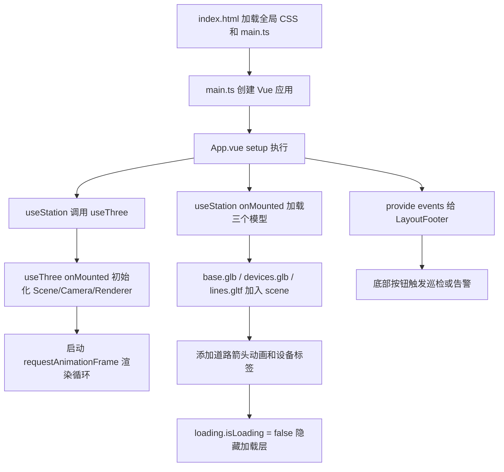

# MF-StationMonitor 项目业务与实现说明

本文档面向准备接手本项目的普通前端开发者，目标是让读者不只知道“文件在哪里”，还要知道“页面为什么这样组织、每个模块负责什么、业务动作如何驱动三维场景、后续改造应该从哪里下手”。

生成日期：2026-06-16

## 1. 项目定位

`MF-StationMonitor` 是一个变电站数字孪生大屏案例。页面展示一个 3D 变电站场景，并在两侧叠加业务监控面板，用来模拟电厂或变电站运维场景中的设备规模、负荷电流、系统损耗、故障对比、视频监控和预警情况。

从业务视角看，它不是一个完整后台系统，而是一个“展示型数字孪生大屏”。目前没有真实接口请求，所有业务指标都来自静态数组或随机模拟数据；真正有交互联动的是底部两个按钮：

- `设备告警`：随机选中 6 台变压器之一，让对应三维模型变红，并把摄像机移动到该设备上方，模拟告警定位。
- `漫游巡检`：让摄像机沿预设点位自动移动，模拟巡检人员或巡检机器人绕站巡检。

从技术视角看，它是一个 Vue 3 + Vite + Three.js + ECharts 的单页大屏：

- Vue 负责页面组件、布局、状态和事件组织。
- Three.js 负责三维场景、模型加载、相机、光照、控制器和动画渲染。
- ECharts 负责左右信息面板里的图表。
- `autofit.js` 负责把 1920 x 1080 的设计稿式大屏缩放适配到实际浏览器尺寸。
- Font Awesome 和项目自带图片资源负责视觉图标、背景框、面板纹理。

## 2. 技术栈与依赖

主要依赖来自 `package.json`：

| 类型 | 依赖 | 用途 |
| --- | --- | --- |
| 框架 | `vue` | Vue 3 组件化开发，使用 `<script setup lang="ts">` |
| 构建 | `vite` | 本地开发、构建、静态资源处理 |
| 三维 | `three` | WebGL 三维场景、相机、灯光、模型加载 |
| 三维动画 | `@tweenjs/tween.js`，实际代码使用 `three/examples/jsm/libs/tween.module.js` | 相机补间动画 |
| 图表 | `echarts` | 柱状图、折线图等业务图表 |
| 适配 | `autofit.js` | 大屏按设计尺寸整体缩放 |
| 工具 | `lodash` | 随机抽样、类型判断、数组生成 |
| 动画 | `gsap`、`animate.css` | 已安装，但当前源码中基本未使用 |
| 样式 | `sass` | Vue 单文件组件中的 SCSS |
| 图标 | Font Awesome 静态资源 | 面板图标、视频占位图标 |

开发相关依赖包括 ESLint、Prettier、Stylelint、Vue TSC、Rollup visualizer、图片压缩插件等。

推荐 Node 版本来自 `.nvmrc`：

```text
v18.19.0
```

项目同时存在 `package-lock.json`、`pnpm-lock.yaml`、`yarn.lock` 三种锁文件。接手时建议团队统一一个包管理器，否则依赖解析结果可能不一致。当前 `package.json` 的脚本都是通用 npm script，`npm`、`pnpm`、`yarn` 都能调用，但锁文件最好只保留实际使用的一种。

## 3. 运行与构建

常用命令：

```bash
npm install
npm run dev
npm run build
npm run preview
```

本地开发服务器配置在 `vite.config.ts`：

- `server.host = '0.0.0.0'`：允许局域网访问。
- `server.port = 8090`：默认端口是 8090。
- `server.open = true`：启动后尝试自动打开浏览器。
- `server.proxy['/bridge']`：代理到 `http://192.168.100.125:8081`，但当前源码没有看到实际请求 `/bridge` 的代码。

构建输出：

- `build.outDir = './docs'`，也就是生产构建产物会输出到根目录的 `docs`。
- `base = './'`，生产资源使用相对路径，适合 GitHub Pages 这类静态目录部署。
- `rollupOptions.output.manualChunks` 把 `node_modules` 依赖统一拆到 `vendor` chunk。
- `assetFileNames = '[ext]/[name]-[hash].[ext]'`，构建后的图片、字体、gif 等按扩展名分目录存放。

项目根目录中的 `docs` 是已构建的静态站点目录，README 中的线上地址也是基于这个静态产物发布。

## 4. 环境变量与静态资源路径

项目通过 `import.meta.env.VITE_API_DOMAIN` 拼接模型和 Draco 解码器路径。

环境文件：

| 文件 | 内容 | 影响 |
| --- | --- | --- |
| `.env` | 空 | 默认环境没有额外值 |
| `.env.development` | `VITE_API_DOMAIN = ''` | 开发环境从站点根路径读取资源，例如 `/models/base.glb` |
| `.env.production` | `VITE_BASE_URL = './'`，`VITE_API_DOMAIN = '.'` | 生产环境从相对路径读取资源，例如 `./models/base.glb` |

三维资源在 `public` 目录中：

```text
public/models/base.glb
public/models/devices.glb
public/models/lines.gltf
public/js/draco/gltf/
public/textures/
public/fonts/
public/fontawesome/
public/styles/boostrap.css
```

这些文件放在 `public` 下，因此开发环境会按根路径直接暴露。比如 `public/models/base.glb` 可以通过 `/models/base.glb` 访问。

源码里的图片背景在 `src/assets`：

```text
src/assets/page_bg.png
src/assets/title_bg.png
src/assets/light_bg.png
src/assets/panel_body_bg.png
src/assets/panel_title_bg.png
src/assets/footer_bg.png
src/assets/footer_item_bg.png
src/assets/label_bg.png
src/assets/loading.gif
```

这些资源由 Vite 作为模块资源处理，组件里通过 `url(@/assets/xxx.png)` 引用。

## 5. 目录结构说明

核心源码目录如下：

```text
src/
  main.ts
  App.vue
  hooks/
    useThree.ts
    useStation.ts
    useEcharts.ts
  components/
    LayoutHeader.vue
    LayoutFooter.vue
    LayoutLoading.vue
    LayoutPanel.vue
    WidgetLabel.vue
    WidgetPanel01.vue
    WidgetPanel02.vue
    WidgetPanel03.vue
    WidgetPanel04.vue
    WidgetPanel05.vue
    WidgetPanel06.vue
  assets/
  types/
    env.d.ts
```

可以按三层理解：

1. 应用入口层：`main.ts`、`App.vue`。
2. 能力 hook 层：`useThree.ts`、`useStation.ts`、`useEcharts.ts`。
3. 展示组件层：布局组件和六个业务面板组件。

更具体地说：

- `main.ts`：创建 Vue 应用，挂载到 `#app`，初始化大屏缩放。
- `App.vue`：搭建大屏整体布局，调用 `useStation` 初始化三维业务，把巡检/告警方法提供给底部按钮。
- `useThree.ts`：封装 Three.js 基础运行时。
- `useStation.ts`：封装变电站三维业务逻辑，是本项目最核心的业务 hook。
- `useEcharts.ts`：封装 ECharts 初始化、设置配置、resize。
- `LayoutHeader.vue`：顶部标题、滚动通知、时间天气展示。
- `LayoutFooter.vue`：底部操作按钮，触发巡检和告警。
- `LayoutLoading.vue`：模型加载遮罩。
- `LayoutPanel.vue`：左右信息面板的统一壳组件。
- `WidgetLabel.vue`：三维场景中的 CSS2D 设备名称标签。
- `WidgetPanel01` 至 `WidgetPanel06`：六个业务面板。

## 6. 页面启动流程

页面启动链路可以这样理解：



需要注意一个隐含顺序：`useStation` 内部先调用 `useThree()`，因此 `useThree` 注册的 `onMounted` 通常会先执行，创建 `scene`、`camera`、`renderer` 等对象；随后 `useStation` 的 `onMounted` 再加载模型并加入场景。当前代码依赖这个注册顺序，没有显式等待 `useThree` 初始化完成。

## 7. 应用入口：main.ts

`src/main.ts` 做了两件事。

第一，创建并挂载 Vue 应用：

```ts
const app = createApp(App)
app.mount('#app')
```

第二，初始化 `autofit.js`：

```ts
const ScreenSize = {
  big: [2560, 1440],
  normal: [1920, 1080],
  small: [1280, 720],
}['normal']

autofit.init({
  el: '#app',
  dw: ScreenSize[0],
  dh: ScreenSize[1],
  resize: true,
})
```

这里固定选择了 `normal`，也就是设计尺寸 1920 x 1080。`autofit` 会按浏览器视口对 `#app` 做缩放，使大屏布局保持比例。对于大屏项目来说，这种做法比普通响应式布局更常见，因为它希望所有面板、背景和三维视口都按设计稿比例缩放。

如果要改成 2560 x 1440 大屏，最直接的位置就是把 `['normal']` 改成 `['big']`，同时检查图片景和面板尺寸是背否仍然合适。

## 8. 根组件布局：App.vue

`App.vue` 是整个页面的骨架。

模板结构：

```vue
<div class="layout">
  <LayoutHeader />
  <LayoutFooter />
  <LayoutLoading :loading="loading" />
  <div class="layout-main">
    <div class="main-left">
      <WidgetPanel04 />
      <WidgetPanel02 />
      <WidgetPanel03 />
    </div>
    <div class="main-right">
      <WidgetPanel01 />
      <WidgetPanel05 />
      <WidgetPanel06 />
    </div>
    <div class="main-middle" ref="container"></div>
  </div>
</div>
```

页面分为四类区域：

- 顶部 `LayoutHeader`：标题和通知。
- 底部 `LayoutFooter`：业务操作按钮。
- 左侧面板区 `main-left`：设备规模、主变电负荷电流变化、系统损耗监测。
- 右侧面板区 `main-right`：故障对比、视频监控、预警情况。
- 中间三维区 `main-middle`：Three.js 渲染容器。

`main-left` 和 `main-right` 都是绝对定位，宽度 420px，距离边缘 10px，`z-index: 999`，因此它们悬浮在三维画布之上。

`main-middle` 占满主区域，并绑定 `ref="container"`。这个 `container` 不是普通 DOM 状态，而是来自 `useStation()`，最终传给 `useThree()` 使用。Three.js 会把 WebGL canvas 和 CSS2D label renderer 的 DOM 插入到这个容器里。

中间区域还有一个径向渐变遮罩：

```scss
.main-middle::before {
  pointer-events: none;
  background-image: radial-gradient(circle, transparent 30%, #000 60%);
}
```

它会让画面中心透明、四周变暗，形成大屏常见的聚焦效果。`pointer-events: none` 保证这个遮罩不拦截鼠标操作。

`App.vue` 的脚本部分：

```ts
const {
  container,
  loading,
  startInspect,
  stopInspect,
  startWarming,
  stopWarming,
} = useStation()

provide('events', { startInspect, stopInspect, startWarming, stopWarming })
```

这里有两个关键点：

1. `useStation()` 返回三维容器、加载状态和业务动作。
2. 通过 Vue 的 `provide` 把业务动作暴露为 `events`，让底部组件 `LayoutFooter` 可以通过 `inject` 调用。

这种设计避免了 `LayoutFooter` 直接导入 `useStation`，保证三维场景只有一份实例。

## 9. Three.js 基础运行时：useThree.ts

`useThree.ts` 是底层三维引擎封装。它只处理通用 Three.js 能力，不关心“变电站业务”。

### 9.1 对外返回的对象

`useThree()` 返回：

```ts
return {
  container,
  scene,
  camera,
  renderer,
  cssRenderer,
  controls,
  mixers,
  renderMixins,
  composers,
  loadGltf,
}
```

这些对象的用途：

| 返回值 | 类型/含义 | 用途 |
| --- | --- | --- |
| `container` | Vue ref | Three.js DOM 容器，由 `App.vue` 绑定到 `.main-middle` |
| `scene` | Three.Scene | 所有模型、灯光、标签都加入这个场景 |
| `camera` | PerspectiveCamera | 主摄像机 |
| `renderer` | WebGLRenderer | 渲染 3D 模型 |
| `cssRenderer` | CSS2DRenderer | 渲染 HTML 标签形式的 3D 标注 |
| `controls` | OrbitControls | 鼠标拖拽、缩放、视角控制 |
| `mixers` | 数组 | 预留给模型骨骼或关键帧动画，目前没有实际添加 mixer |
| `renderMixins` | Map | 每帧额外执行的函数集合，道路箭头动画就注册在这里 |
| `composers` | Map | 预留给后处理 composer，目前 outline 代码被注释 |
| `loadGltf` | 函数 | 使用 GLTFLoader + DRACOLoader 加载模型 |

### 9.2 初始化场景

`boostrap()` 函数在 `onMounted` + `nextTick` 后执行。代码中拼写为 `boostrap`，语义上就是 `bootstrap`。

初始化步骤：

1. 从 `container.value` 读取 `clientWidth`、`clientHeight`。
2. 创建 `THREE.Scene()`。
3. 创建透视相机：

```ts
camera.value = new THREE.PerspectiveCamera(
  45,
  clientWidth / clientHeight,
  1,
  10000
)
camera.value.position.set(20, 15, 20)
```

相机参数含义：

- 视角 FOV 是 45 度。
- 宽高比来自容器尺寸。
- 近裁剪面 1，远裁剪面 10000。
- 初始位置是 `(20, 15, 20)`，看向后面设置的控制器目标 `(0, 5, 0)`。

4. 创建 WebGL renderer：

```ts
renderer.value = new THREE.WebGLRenderer({ antialias: true, alpha: true })
renderer.value.shadowMap.enabled = false
renderer.value.outputColorSpace = THREE.SRGBColorSpace
renderer.value.setSize(clientWidth, clientHeight)
renderer.value.setClearAlpha(0.5)
container.value!.appendChild(renderer.value.domElement)
```

这里开启抗锯齿和透明背景，关闭阴影。`setClearAlpha(0.5)` 让清屏背景有透明度，方便和页面背景叠加。

5. 创建 CSS2D renderer：

```ts
cssRenderer.value = new CSS2DRenderer()
cssRenderer.value.setSize(clientWidth, clientHeight)
cssRenderer.value.domElement.className = 'css2d-renderer'
cssRenderer.value.domElement.style.position = 'absolute'
cssRenderer.value.domElement.style.top = '0px'
cssRenderer.value.domElement.style.pointerEvents = 'none'
container.value!.appendChild(cssRenderer.value.domElement)
```

CSS2D renderer 用来把 Vue 组件生成的 HTML 标签放进三维世界。它的 DOM 层覆盖在 WebGL canvas 上方。整体设置 `pointerEvents = 'none'`，但标签组件自身又设置了 `pointer-events: all`，所以标签仍可点击。

6. 创建 OrbitControls：

```ts
controls.value = new OrbitControls(camera.value, renderer.value.domElement)
controls.value.minPolarAngle = 0
controls.value.enableDamping = true
controls.value.dampingFactor = 0.1
controls.value.target.set(0, 5, 0)
controls.value.maxPolarAngle = Math.PI / 2
controls.value.minDistance = 10
controls.value.maxDistance = 100
controls.value.update()
```

控制器含义：

- 鼠标围绕目标点 `(0, 5, 0)` 旋转。
- `maxPolarAngle = Math.PI / 2` 限制相机不能转到地面以下。
- `minDistance = 10`、`maxDistance = 100` 限制缩放距离。
- `enableDamping` 和 `dampingFactor` 让拖拽有惯性。

7. 添加灯光：

```ts
const ambientLight = new THREE.AmbientLight(0x999999, 10)
scene.value.add(ambientLight)

const directionalLight = new THREE.DirectionalLight(0xffffff, 0.5)
directionalLight.position.set(20, 20, 20)
scene.value.add(directionalLight)
```

环境光强度设为 10，比较高，适合展示型白模场景，保证模型整体明亮。平行光从 `(20, 20, 20)` 方向补光。

### 9.3 渲染循环

`animate()` 是每帧循环函数：

```ts
const animate = () => {
  const delta = new THREE.Clock().getDelta()
  renderer.value!.render(scene.value!, camera.value!)
  const mixerUpdateDelta = clock.getDelta()
  mixers.forEach((mixer: any) => mixer.update(mixerUpdateDelta))
  composers.forEach((composer) => composer.render(delta))
  renderMixins.forEach((mixin) => isFunction(mixin) && mixin())
  cssRenderer.value!.render(scene.value!, camera.value!)
  TWEEN.update()
  requestAnimationFrame(() => animate())
}
```

每帧执行顺序：

1. WebGL renderer 渲染三维场景。
2. 更新 `mixers`，预留给模型动画。
3. 执行后处理 `composers`，目前没有启用。
4. 执行 `renderMixins`，例如道路箭头贴图滚动。
5. CSS2D renderer 渲染设备标签。
6. `TWEEN.update()` 推进相机补间动画。
7. `requestAnimationFrame` 进入下一帧。

这里的 `renderMixins` 是一个非常重要的扩展点。业务层不需要改 `animate`，只要往 `renderMixins` 里 `set` 一个函数，就能让该函数每帧执行。

### 9.4 GLTF 与 Draco 加载

模型加载器配置：

```ts
const dracoLoader = new DRACOLoader()
dracoLoader.setDecoderPath(
  `${import.meta.env.VITE_API_DOMAIN}/js/draco/gltf/`
)
dracoLoader.setDecoderConfig({ type: 'js' })
```

说明：

- 项目模型可能使用 Draco 压缩。
- 解码器文件放在 `public/js/draco/gltf/`。
- 开发环境 `VITE_API_DOMAIN` 为空，所以路径是 `/js/draco/gltf/`。
- 生产环境 `VITE_API_DOMAIN` 为 `.`，所以路径是 `./js/draco/gltf/`。

`loadGltf(url)` 返回一个 Promise：

```ts
const loadGltf = (url: string): Promise<GLTF> => {
  const loader = new GLTFLoader()
  loader.setDRACOLoader(dracoLoader)
  return new Promise<GLTF>((resolve) => {
    loader.load(url, (object: GLTF) => resolve(object))
  })
}
```

当前实现只有成功回调，没有失败回调和加载进度回调。如果模型路径错误，加载层可能一直停留或静默失败。生产化时建议补上 `onProgress` 和 `onError`。

## 10. 变电站业务核心：useStation.ts

`useStation.ts` 是本项目最重要的业务文件。它在 `useThree` 的基础上实现变电站模型加载、设备标注、道路箭头动画、巡检和告警。

### 10.1 模型资源

模型路径定义：

```ts
const Sources = {
  BuildingModel: `${import.meta.env.VITE_API_DOMAIN}/models/base.glb`,
  DeviceModel: `${import.meta.env.VITE_API_DOMAIN}/models/devices.glb`,
  LineModel: `${import.meta.env.VITE_API_DOMAIN}/models/lines.gltf`,
}
```

三个模型职责：

| 模型 | 文件 | 业务含义 |
| --- | --- | --- |
| `BuildingModel` | `base.glb` | 变电站基础环境，包括建筑、道路、围墙、电塔、摄像头、道路箭头等 |
| `DeviceModel` | `devices.glb` | 站内设备，包括高抗组、变压器组、隔离开关组等 |
| `LineModel` | `lines.gltf` | 电线或连线模型 |

从模型元数据看：

- `base.glb` 有 994 个节点、52 个 mesh、51 个材质、33 个纹理，根节点包括 `避雷柱组`、`变压桥塔组`、`高压电塔组`、`地基围墙`、`配电室`、`主控室`、`警卫室`、`摄像头`、`1#道路箭头` 至 `7#道路箭头`。
- `devices.glb` 有 6393 个节点、731 个 mesh，根节点包括 `设备一组`、`管道二组`、`高抗组`、`管道三组`、`变压器组`、`设备舱组`、`隔离开关组`、`设备二组`、`管道一组`、`设备三组`。
- `lines.gltf` 有 316 个节点、312 个 mesh，主要分组是 `wireGroup`。

这说明业务代码不是凭空假设，它确实依赖模型节点命名和层级。

### 10.2 加载状态

加载状态是一个 reactive 对象：

```ts
const loading = reactive({
  total: 3,
  loaded: 0,
  isLoading: true,
})
```

含义：

- `total = 3` 表示需要加载 3 个模型。
- `loaded` 每完成一个模型加 1。
- `isLoading` 控制 `LayoutLoading` 是否显示。

`LayoutLoading.vue` 会显示：

```text
模型正在加载中 (loaded/total) ...
```

### 10.3 加载模型

`loadModel()` 内部定义三个异步函数：

```ts
const loadBuildingModel = async () => { ... }
const loadDeviceModel = async () => { ... }
const loadLineModel = async () => { ... }
await Promise.all([loadBuildingModel(), loadDeviceModel(), loadLineModel()])
```

三个模型并行加载，全部完成后：

```ts
loading.isLoading = false
loading.loaded = 3
```

加载基础模型：

```ts
const gltf = await loadGltf(Sources.BuildingModel)
loading.loaded += 1
models.building = gltf.scene
scene.value.add(gltf.scene)
```

加载设备模型：

```ts
const gltf: any = await loadGltf(Sources.DeviceModel)
devices.value.push(...gltf.scene.children[4].children)
loading.loaded += 1
models.devices = gltf.scene
scene.value.add(gltf.scene)
```

这里最关键的是：

```ts
gltf.scene.children[4].children
```

根据模型元数据，`devices.glb` 的第 5 个根分组，也就是下标 4，是 `变压器组`。它有 6 个子节点：

```text
1#变压器
2#变压器
3#变压器
4#变压器
5#变压器
6#变压器
```

因此 `devices.value` 实际保存的是 6 台变压器模型对象。后面的“设备告警”只会在这 6 台变压器中随机选择一台。

如果以后更换 `devices.glb`，必须确认 `变压器组` 仍在 `gltf.scene.children[4]`。更稳妥的写法是按节点名称查找 `name === '变压器组'`，而不是硬编码数组下标。

加载连线模型：

```ts
const gltf = await loadGltf(Sources.LineModel)
loading.loaded += 1
models.lines = gltf.scene
scene.value.add(gltf.scene)
```

### 10.4 道路箭头动画

`addRoadArrowAnimation()` 的作用是让地面道路箭头贴图产生流动效果。

逻辑：

1. 遍历 `models.building`。
2. 找到名称包含 `道路箭头` 的 mesh。
3. 收集这些 mesh 的 `material.map`。
4. 每帧修改贴图的 `offset.y`。

代码核心：

```ts
models.building.traverse((mesh: any) => {
  mesh.name.includes('道路箭头') && textures.push(mesh.material.map)
})

const animation = () => {
  textures.forEach((texture) => {
    texture.offset.y = (texture.offset.y + 0.02) % 10000
  })
}

renderMixins.set('road-arrow', animation)
```

这个函数没有自己启动 `requestAnimationFrame`，而是把 `animation` 注册到 `useThree` 的 `renderMixins` 中。之后每帧 `useThree.animate()` 都会调用它。

从模型元数据看，`base.glb` 中确实存在 `1#道路箭头` 到 `7#道路箭头` 7 个节点。

### 10.5 三维设备标签

`LabelPositions` 定义了 18 个标签：

- 6 个 `550KV I线高抗`。
- 6 个 `变压器`。
- 6 个 `隔离开关`。

每个标签包含：

```ts
{
  name: '1# 变压器',
  position: [-32, 8, -6],
}
```

`position` 是三维世界坐标，分别对应 x、y、z。

`addDeviceLabels()` 做了一个很有意思的桥接：它把 Vue 组件渲染成 DOM，再交给 Three.js 的 `CSS2DObject`。

核心逻辑：

```ts
const cRender = (component: any, props: any) => {
  const newComponent = defineComponent({
    render() {
      return h(component, props)
    },
  })
  const instance = createVNode(newComponent)
  render(instance, document.createElement('div'))
  return instance.el
}

LabelPositions.forEach((item) => {
  const label = new CSS2DObject(cRender(WidgetLabel, item))
  label.position.set(...item.position)
  scene.value.add(label)
})
```

`WidgetLabel.vue` 本身很简单：

```vue
<div class="label" @click="onClick">{{ name }}</div>
```

点击标签会：

```ts
alert(props.name)
```

也就是说，当前标签点击只是演示性质。后续可以把这里改成打开设备详情弹窗、联动右侧预警列表、定位摄像机等。

### 10.6 相机动画封装

`cameraAnimation()` 是巡检和告警共用的基础能力。

入参：

```ts
const cameraAnimation = (
  oldPosition,
  oldTarget,
  newPosition,
  newTarget,
  during = 1000,
  time = TWEEN.Easing.Cubic.InOut
) => { ... }
```

它同时补间两组数据：

- 摄像机位置：`camera.value.position`
- 控制器目标点：`controls.value.target`

补间对象结构：

```ts
const start = {
  x1: oldPosition.x,
  y1: oldPosition.y,
  z1: oldPosition.z,
  x2: oldTarget.x,
  y2: oldTarget.y,
  z2: oldTarget.z,
}

const stop = {
  x1: newPosition.x,
  y1: newPosition.y,
  z1: newPosition.z,
  x2: newTarget.x,
  y2: newTarget.y,
  z2: newTarget.z,
}
```

每次更新时：

```ts
camera.value.position.x = object.x1
camera.value.position.y = object.y1
camera.value.position.z = object.z1
controls.value.target.x = object.x2
controls.value.target.y = object.y2
controls.value.target.z = object.z2
controls.value.update()
```

这样做的效果是：相机不只是移动位置，还会同步调整“看向哪里”。如果只改相机位置不改 target，视角可能不自然；如果只改 target 不改位置，就像原地转头。

函数返回的是 `tween` 对象，调用者可以 `.start()`、`.chain()` 或 `.stop()`。

### 10.7 漫游巡检业务

`startInspect()` 是“漫游巡检”的核心。

它返回一个 Promise，巡检结束时 resolve：

```ts
const startInspect = () => {
  return new Promise((resolve) => {
    ...
    tweenJ.onComplete(() => {
      resolve(true)
    })
  })
}
```

内部定义了 10 个巡检点位。每个点包含：

```ts
{
  position: { x, y, z },
  target: { x, y, z },
}
```

`position` 是相机所在位置，`target` 是相机看向的位置。

巡检路径大致逻辑：

1. 从当前视角移动到巡检起点。
2. 沿站内道路或设备区域移动。
3. 多次转向，从一侧移动到另一侧。
4. 最后回到默认总览视角：

```ts
position: { x: 20, y: 15, z: 20 }
target: { x: 0, y: 5, z: 0 }
```

动画链如下：

```ts
inspect.value.chain(tweenB)
tweenB.chain(tweenC)
tweenC.chain(tweenD)
tweenD.chain(tweenE)
tweenE.chain(tweenF)
tweenF.chain(tweenG)
tweenG.chain(tweenH)
tweenH.chain(tweenI)
tweenI.chain(tweenJ)
inspect.value.start()
```

持续时间：

| 段落 | 时间 | 缓动 |
| --- | --- | --- |
| 当前视角到起点 | 2000ms | Linear.None |
| A 到 B | 6000ms | Linear.None |
| B 到 C | 2000ms | Quadratic.InOut |
| C 到 D | 2500ms | Linear.None |
| D 到 E | 2000ms | Quadratic.InOut |
| E 到 F | 6000ms | Linear.None |
| F 到 G | 2000ms | Quadratic.InOut |
| G 到 H | 2500ms | Linear.None |
| H 到 I | 2000ms | Quadratic.InOut |
| I 到 J | 2000ms | Quadratic.InOut |

总时长约 29 秒。

`stopInspect()` 用于停止巡检并回到总览：

```ts
inspect.value?.stop()
cameraAnimation(
  currentCameraPosition,
  currentControlsTarget,
  { x: 20, y: 15, z: 20 },
  { x: 0, y: 5, z: 0 },
  6000,
  TWEEN.Easing.Linear.None
).start()
```

这里有一个实现注意点：`inspect.value` 保存的是第一段 tween。巡检链已经走到后面某段时，直接 `inspect.value.stop()` 未必能停止当前已经启动的后续 tween。当前 UI 里用户点击“取消巡检”会触发回总览动画，但更严谨的实现应该保存当前活跃 tween，或者对整个 tween group 做统一停止。

### 10.8 设备告警业务

代码中的函数名是 `startWarming` / `stopWarming`，业务含义其实是 `Warning`，也就是告警。这里是拼写问题，不影响运行。

`startWarming()` 内部定义 `handle()`，并立即执行一次，然后每 2 秒执行一次：

```ts
handle()
warmingTimer.value = setInterval(handle, 1000 * 2)
```

每次 `handle()` 做四件事。

第一，恢复上一台告警设备的颜色：

```ts
if (warmingCurrent.value) {
  warmingCurrent.value.traverse((mesh: any) => {
    if (!(mesh instanceof THREE.Mesh)) return undefined
    mesh.material.emissive.setHex(mesh.currentHex)
  })
}
```

第二，从 6 台变压器中随机选一台：

```ts
const index = sample([0, 1, 2, 3, 4, 5]) ?? 0
warmingCurrent.value = devices.value[index]
```

第三，把摄像机移动到该变压器附近：

```ts
cameraAnimation(
  camera.value.position,
  controls.value.target,
  {
    x: -31 + 12 * index,
    y: 22,
    z: 13,
  },
  {
    x: -31 + 12 * index,
    y: 0,
    z: -7,
  }
).start()
```

这里的坐标公式说明 6 台变压器在 x 轴方向上近似等间距排列：

```text
x = -31 + 12 * index
```

当 index 为 0 至 5 时，相机依次定位到：

```text
-31, -19, -7, 5, 17, 29
```

这与 `LabelPositions` 中 6 台变压器的大致 x 坐标也比较接近。

第四，把当前设备的 mesh 材质克隆并设置自发光红色：

```ts
warmingCurrent.value.traverse((mesh: any) => {
  if (!(mesh instanceof THREE.Mesh)) return undefined
  mesh.material = mesh.material.clone()
  mesh.currentHex = mesh.currentHex ?? mesh.material.emissive.getHex()
  mesh.material.emissive.setHex(0xff0000)
})
```

为什么要 `mesh.material.clone()`？

很多 GLTF 模型中的多个 mesh 可能共享同一个材质对象。如果直接修改共享材质，可能导致多个设备一起变红。克隆后再修改，能尽量把告警颜色限制在当前设备对象上。

`mesh.currentHex` 保存原始 emissive 颜色，用于取消告警时恢复。

`stopWarming()` 做两件事：

1. 恢复当前告警设备原始颜色。
2. 清除定时器并把相机移回总览视角。

```ts
window.clearInterval(warmingTimer.value)
cameraAnimation(
  currentCameraPosition,
  currentControlsTarget,
  { x: 20, y: 15, z: 20 },
  { x: 0, y: 5, z: 0 },
  2000,
  TWEEN.Easing.Linear.None
).start()
```

### 10.9 useStation 生命周期

`useStation` 在挂载后执行：

```ts
onMounted(() => {
  nextTick(async () => {
    await loadModel()
    addRoadArrowAnimation()
    addDeviceLabels()
  })
})
```

顺序是：

1. 加载模型。
2. 模型加载完成后添加道路箭头动画。
3. 添加设备标签。

这意味着标签和箭头动画都依赖模型加载成功。加载层只有在 `loadModel()` 完成后才隐藏。

## 11. 底部交互：LayoutFooter.vue

`LayoutFooter.vue` 是业务交互入口。

模板中有两个按钮：

```vue
<div class="item" :style="warmingStyle" @click="warmingHandle">
  {{ state.isWarming ? '取消告警' : '设备告警' }}
</div>
<div class="item" :style="inspectStyle" @click="inspectHandle">
  {{ state.isInspect ? '取消巡检' : '漫游巡检' }}
</div>
```

本地状态：

```ts
const state = reactive({
  isWarming: false,
  isInspect: false,
})
```

注入 App 提供的事件：

```ts
const events = inject<any>('events')
```

### 11.1 告警按钮逻辑

```ts
const warmingHandle = async () => {
  if (state.isInspect) return void 0
  state.isWarming = !state.isWarming
  if (state.isWarming) {
    events.startWarming()
  } else {
    events.stopWarming()
  }
}
```

规则：

- 如果正在巡检，告警按钮不可用，直接 return。
- 如果当前未告警，点击后进入告警状态，调用 `startWarming()`。
- 如果当前正在告警，点击后取消告警，调用 `stopWarming()`。

### 11.2 巡检按钮逻辑

```ts
const inspectHandle = async () => {
  if (state.isWarming) return void 0
  state.isInspect = !state.isInspect
  if (state.isInspect) {
    await events.startInspect()
    state.isInspect = false
  } else {
    await events.stopInspect()
  }
}
```

规则：

- 如果正在告警，巡检按钮不可用。
- 如果当前未巡检，点击后启动巡检。
- `startInspect()` 的 Promise 完成后，自动把 `isInspect` 改回 `false`，按钮文案从 `取消巡检` 变回 `漫游巡检`。
- 如果当前正在巡检，再次点击则调用 `stopInspect()`。

### 11.3 互斥关系

底部两个业务动作是互斥的：

- 巡检中不能启动告警。
- 告警中不能启动巡检。

互斥通过两个地方体现：

1. 点击函数开头直接 return。
2. computed style 把鼠标样式改为 `not-allowed`。

按钮激活时颜色会变成 `#5bc7fa`，未激活时是白色。

## 12. 顶部与加载布局组件

### 12.1 LayoutHeader.vue

顶部标题是：

```text
电厂数字孪生服务平台
Power plant digital twin service platform
```

左侧有一个系统通知，内容来自 DOM attribute：

```vue
content="【系统通知】感谢大家对我们项目的关注与支持!希望能为我们的项目点一个Star,您的支持对我们来说至关重要。"
```

CSS 通过 `content: attr(content)` 把 attribute 内容显示出来，并用 `text-roll` 动画横向滚动。

右侧时间天气是静态写死的：

```text
12:00:00
2024-12-34
Monday
13°c
```

注意 `2024-12-34` 不是合法日期。当前它只是视觉占位，并非真实时间。如果要生产化，需要接入定时器或后端数据。

顶部还通过 `title_bg.png` 和 `light_bg.png` 做背景与扫光动画。

### 12.2 LayoutLoading.vue

加载层通过 `v-show="loading.isLoading"` 控制。

它覆盖全屏：

```scss
position: absolute;
z-index: 99999;
width: 100%;
height: 100%;
background: #000;
```

显示内容包括：

- 一个 `loading.gif` 背景动画。
- 加载进度文字：`模型正在加载中 (loaded/total) ...`

目前加载进度不是按字节或百分比，而是按 3 个模型文件的完成数量计算。

### 12.3 LayoutPanel.vue

`LayoutPanel` 是所有信息面板共用外壳。

props：

```ts
interface PropsType {
  title: string | number
}
```

结构：

```vue
<div class="layout-panel">
  <div class="panel-header">
    <div class="panel-header-title">{{ title }}</div>
  </div>
  <div class="panel-body">
    <slot></slot>
  </div>
</div>
```

所有 `WidgetPanel` 都把自己的图表或列表放进 slot。这样可以统一面板背景、标题栏、body 高度和字体。

## 13. ECharts 封装：useEcharts.ts

`useEcharts()` 是图表组件共用 hook。

返回：

```ts
return { container, chart, setOption, resize, clear, echarts }
```

用法模式：

1. 组件里调用 `useEcharts()`。
2. 模板中把 `container` 绑定到图表 div：

```vue
<div class="container" ref="container"></div>
```

3. `onMounted` 后生成 option，调用 `setOption(options)`。

初始化逻辑：

```ts
const boostrap = (theme = 'light') => {
  if (chart.value) chart.value?.dispose()
  if (isElement(container.value)) {
    chart.value = echarts.init(container.value, theme)
  } else {
    console.warn('容器还未初始化')
  }
  window.removeEventListener('resize', resize)
  window.addEventListener('resize', resize)
}
```

`setOption`：

```ts
const setOption = (option: any) => {
  cache = option
  if (!chart.value) boostrap()
  chart.value?.setOption(option)
}
```

说明：

- 第一次 `setOption` 时，如果图表还未初始化，会自动初始化。
- `resize` 会绑定到窗口 resize。
- `clear()` 可以清空图表。
- `echarts` 本体也返回出去，是为了让组件里能使用 `echarts.graphic.LinearGradient`。

注意点：

- `cache` 变量当前只赋值，没有被使用。
- `onUnmounted` 移除了 resize 监听，但没有 `chart.dispose()`。
- 大屏整体使用 `autofit` 缩放，窗口 resize 后图表 resize 是有意义的，但 Three.js renderer 没有对应 resize 逻辑。

## 14. 六个业务面板详解

### 14.1 WidgetPanel04：设备规模

标题：`设备规模`

位置：左侧第一块。

这个组件没有图表，直接用 3 x 3 grid 展示设备类型和数量。

数据源：

```ts
const source = [
  { icon: 'fa-solid fa-temperature-three-quarters', label: '玻璃探测器', value: '23', unit: '个' },
  { icon: 'fa-solid fa-shower', label: '风机房', value: '23', unit: '个' },
  { icon: 'fa-solid fa-fan', label: '接地变110V', value: '23', unit: '个' },
  { icon: 'fa-solid fa-signs-post', label: '巡更锚点', value: '11', unit: '个' },
  { icon: 'fa-solid fa-wind', label: '高压探测器', value: '63', unit: '个' },
  { icon: 'fa-solid fa-cloud-rain', label: '红外探测器', value: '23', unit: '个' },
  { icon: 'fa-solid fa-whiskey-glass', label: '开关柜35KV', value: '12', unit: '个' },
  { icon: 'fa-solid fa-water', label: '烟感探测器', value: '12', unit: '个' },
  { icon: 'fa-solid fa-fill-drip', label: '水浸探测室', value: '13.2', unit: '个' },
]
```

业务含义：展示站内各类设备或传感器的数量概览。当前数量都是静态示例值。

实现特点：

- 每个 item 使用 Font Awesome 图标。
- icon 圆形边框固定 34px。
- label 用灰色，value 用白色，突出数量。
- 变量名里有 `weather`，比如 `.weather-monitor`，但真实业务是设备规模，不是天气。

如果要接接口，最简单方式是把 `source` 改成 `ref([])`，在 `onMounted` 请求接口后赋值。

### 14.2 WidgetPanel02：主变电负荷电流变化

标题：`主变电负荷电流变化`

位置：左侧第二块。

图表类型：三条平滑折线。

业务含义：展示 1#、2#、3# 主变在一天部分时间段内的负荷电流变化趋势。

x 轴：

```ts
['11:00', '12:00', '13:00', '14:00', '15:00', '16:00', '17:00']
```

三条 series：

- `1#`：绿色线。
- `2#`：蓝色线。
- `3#`：黄色线。

数据生成：

```ts
const sources = [
  sampleSize(range(1000, 200), 7),
  sampleSize(range(1000, 200), 7),
  sampleSize(range(1000, 200), 7),
]
```

`lodash.range(1000, 200)` 会生成从 1000 递减到 201 的数列，`sampleSize(..., 7)` 随机取 7 个值。因此每次刷新页面折线数据都会变化。

图表配置特点：

- `boundaryGap: false`，折线贴近 x 轴两端。
- `symbol: 'none'`，不显示每个点的圆点。
- `smooth: true`，曲线平滑。
- tooltip 黑底白字，适配深色大屏。
- y 轴分隔线是半透明虚线。

如果要改为真实电流数据，应保证接口返回结构能对应 7 个时间点，或者动态生成 x 轴和 series 数据。

### 14.3 WidgetPanel03：系统损耗监测

标题：`系统损耗监测`

位置：左侧第三块。

图表类型：柱状图。

业务含义：展示系统损耗在 30 个采样点上的变化。当前没有单位，属于模拟监测指标。

x 轴：

```ts
data: [...Array(30).keys()]
```

也就是 0 到 29。

y 轴数据：

```ts
Array.from({ length: 30 }).map(() => Math.random() * 90 + 10)
```

生成 30 个 10 到 100 之间的随机数。

柱体颜色：

```ts
new echarts.graphic.LinearGradient(0, 0, 0, 1, [
  { offset: 0, color: 'rgba(0, 254, 169, 1)' },
  { offset: 1, color: 'rgba(65, 138, 255, 0.2)' },
])
```

从绿色渐变到蓝色半透明，符合大屏科技风。

### 14.4 WidgetPanel01：故障对比

标题：`故障对比`

位置：右侧第一块。

图表类型：双系列柱状图。

业务含义：对比 2024 年与 2025 年在 8 月至 12 月的故障数量或故障指标。

x 轴：

```ts
['08月', '09月', '10月', '11月', '12月']
```

series：

```ts
{
  name: '2024年',
  data: [320, 332, 301, 334, 390],
}
{
  name: '2025年',
  data: [220, 182, 191, 234, 290],
}
```

视觉设计：

- 2024 年用绿色渐变柱。
- 2025 年用蓝色渐变柱。
- legend 放在右上角。
- tooltip 触发方式为 `axis`，鼠标悬停时按月份显示两个系列。

### 14.5 WidgetPanel05：视频监控

标题：`视频监控`

位置：右侧第二块。

当前实现是占位状态：

```vue
<div class="video-images">
  <!-- <video src="/images/camera.mp4" autoplay></video> -->
  <i class="fa-solid fa-video-slash"></i>
</div>
```

业务含义：预留视频监控区域。目前没有真实视频源，只显示 Font Awesome 的 `video-slash` 图标。

如果要接入视频：

- 本地 mp4：打开注释，设置正确 `src`。
- HLS：引入 `hls.js`，用 `video` 播放 `.m3u8`。
- WebRTC：需要更复杂的信令和流处理。
- 海康/大华等监控平台：通常要接厂商 SDK 或后端转码服务。

### 14.6 WidgetPanel06：预警情况

标题：`预警情况`

位置：右侧第三块。

业务含义：展示传感器、风机房、巡更锚点等设备的预警事件流。

数据结构：

```ts
{
  name: '1#变压器传感器',
  event: '失联',
  type: 1,
  time: '08:21',
}
```

字段含义：

| 字段 | 含义 |
| --- | --- |
| `name` | 设备或点位名称 |
| `event` | 事件类型或告警内容 |
| `type` | 告警颜色类型 |
| `time` | 发生时间 |

颜色逻辑：

```ts
const colors = {
  1: '#74fabd',
  2: '#5bc7fa',
  3: '#f1bd49',
}
```

- `type = 1`：绿色。
- `type = 2`：蓝色。
- `type = 3`：黄色。

如果 `gradual = true`，返回横向渐变背景：

```ts
linear-gradient(90deg, ${colors[type]}77 , transparent )
```

滚动逻辑：

```ts
timer = setInterval(() => {
  container.value.classList.add('scroll')
  setTimeout(() => {
    if (!timer) return void 0
    container.value.classList.remove('scroll')
    list.value.push(list.value.shift())
  }, 2000)
}, 3000)
```

每 3 秒：

1. 给列表容器加 `scroll` class。
2. CSS 动画把列表整体向上移动 36px。
3. 2 秒后移除 `scroll`。
4. 把数组第一项移到末尾，实现循环滚动。

CSS 动画：

```scss
@keyframes row-out {
  from { top: 0; }
  to { top: -36px; }
}
```

注意点：

- 组件没有在 `onUnmounted` 中清除 timer。
- CSS 中 `.row:first-child` 选择器与模板里的 `.item` 不匹配，应该是历史遗留或笔误。
- `v-for` 没有 `:key`，Vue 会报警或不利于稳定复用，建议加唯一 key。

## 15. 业务数据现状

当前项目没有真实后端数据。各业务模块的数据来源如下：

| 模块 | 数据来源 | 是否实时 |
| --- | --- | --- |
| 设备规模 | `WidgetPanel04.vue` 静态数组 | 否 |
| 主变电负荷电流变化 | `WidgetPanel02.vue` 页面加载时随机生成 | 否 |
| 系统损耗监测 | `WidgetPanel03.vue` 页面加载时随机生成 | 否 |
| 故障对比 | `WidgetPanel01.vue` 静态数组 | 否 |
| 视频监控 | 无视频源，占位图标 | 否 |
| 预警情况 | `WidgetPanel06.vue` 静态数组 + 前端轮播 | 否 |
| 三维模型 | `public/models` 静态文件 | 模型固定 |
| 设备告警 | 前端每 2 秒随机选择变压器 | 模拟实时 |
| 漫游巡检 | 前端预设坐标动画 | 模拟流程 |

因此，接入真实业务系统时，主要工作是：

1. 替换面板静态数据为接口数据。
2. 建立设备 ID 与三维模型节点之间的映射。
3. 让告警列表、告警高亮、相机定位由同一份真实告警数据驱动。
4. 接入视频流。
5. 处理模型加载失败、接口失败、无数据等状态。

## 16. 三维模型与业务对象的对应关系

当前业务最强绑定的是 `devices.glb` 中的 `变压器组`。

代码：

```ts
devices.value.push(...gltf.scene.children[4].children)
```

模型结构：

```text
devices.glb
  设备一组
  管道二组
  高抗组
  管道三组
  变压器组
    1#变压器
    2#变压器
    3#变压器
    4#变压器
    5#变压器
    6#变压器
  设备舱组
  隔离开关组
  设备二组
  管道一组
  设备三组
```

因此：

- 告警随机选择的是 `1#变压器` 至 `6#变压器`。
- 设备标签里也有 `1# 变压器` 至 `6# 变压器`。
- 相机定位公式也按 6 台变压器横向排列写死。

如果要让高抗或隔离开关也能告警，需要：

1. 加载模型后找到 `高抗组` 或 `隔离开关组`。
2. 保存设备对象数组。
3. 为每个设备建立业务 ID、名称、模型对象、相机 position、target。
4. 告警时按真实设备 ID 找模型，而不是随机 index。

建议设计成：

```ts
type DeviceSceneNode = {
  id: string
  name: string
  type: 'transformer' | 'reactor' | 'switch'
  object: THREE.Object3D
  cameraPosition: { x: number; y: number; z: number }
  cameraTarget: { x: number; y: number; z: number }
}
```

这样 `startWarming` 就可以改成 `startWarning(deviceId)`。

## 17. 全局样式与字体

全局样式不是在 `main.ts` 中 import，而是在 `index.html` 中直接引入：

```html
<link rel="stylesheet" href="/styles/boostrap.css" />
<link rel="stylesheet" href="/fontawesome/css/all.css" />
```

`public/styles/boostrap.css` 定义了字体：

```css
@font-face {
  font-family: SarasaMonoTSCBoldItalic;
  src: url(../fonts/SarasaMonoTSCBoldItalic.woff2);
}

@font-face {
  font-family: Furore;
  src: url(../fonts/Furore.woff2);
}

@font-face {
  font-family: DsDigital;
  src: url(../fonts/DsDigital.woff2);
}

@font-face {
  font-family: DouYu;
  src: url(../fonts/DouyuFont.woff2);
}
```

全局重置：

```css
* {
  padding: 0;
  margin: 0;
  list-style: none;
}

#app {
  width: 100%;
  height: 100%;
  overflow: hidden;
  font-family: SarasaMonoTSCBoldItalic;
}
```

注意点：`PangMenZhengDaoBiaoTiTiMianFeiBan` 的 CSS 引用是 `.woff`，但 public/fonts 中看到的是 `.woff2` 文件。如果该字体实际被使用，可能加载失败。当前主要组件使用 `DouYu` 和默认字体，影响不明显。

## 18. TypeScript 类型声明

`src/types/env.d.ts` 除了引用 Vite 类型，还手写声明了多个 Three.js 相关模块：

```ts
declare module 'three' { ... }
declare module 'three/examples/jsm/controls/OrbitControls' { ... }
declare module 'three/examples/jsm/loaders/DRACOLoader' { ... }
declare module 'three/examples/jsm/loaders/GLTFLoader' { ... }
declare module 'three/examples/jsm/renderers/CSS2DRenderer' { ... }
declare module 'three/examples/jsm/libs/tween.module.js' { ... }
```

这些声明的作用是让 TypeScript 编译能通过，尤其是 Three examples 里的模块类型。

但它们也有风险：

- `declare module 'three'` 会覆盖或弱化官方 `three` 类型理解。
- 很多字段都写成 `any`。
- 对真实 API 的约束很弱，写错属性也可能不报错。

如果项目后续要长期维护，建议优先使用 Three.js 自带类型，减少自定义覆盖，只对缺失的 examples 模块做最小补充。

## 19. 构建配置细节

`vite.config.ts` 使用的插件：

```ts
plugins: [
  vue(),
  vueJsx(),
  stylelintPlugin({ fix: true }),
  visualizer({ open: true }),
  viteImagemin({ ... }),
]
```

说明：

- `vue()` 支持 `.vue` 单文件组件。
- `vueJsx()` 支持 Vue JSX，当前源码没有明显使用 JSX，但保留无害。
- `stylelintPlugin({ fix: true })` 开发或构建时会尝试自动修复样式。
- `visualizer({ open: true })` 构建后会生成并打开包分析页面，根目录已有 `stats.html`。
- `viteImagemin` 会压缩 gif、png、jpg、svg。图片压缩插件可能依赖较多二进制能力，CI 环境中需要关注安装稳定性。

CSS 里配置了 Less 变量：

```ts
css: {
  preprocessorOptions: {
    less: {
      modifyVars: {
        'border-radius-small': '0px',
        'border-radius-medium': '0px',
        'border-radius-large': '0px',
      },
      javascriptEnabled: true,
    },
  },
}
```

当前源码使用的是 SCSS，不是 Less。这段配置可能是模板遗留，用于兼容某些 UI 库主题变量，但当前项目没有明显使用。

## 20. 已知问题与维护注意点

下面这些不是阻断运行的问题，但接手时应该知道。

| 问题 | 位置 | 说明 |
| --- | --- | --- |
| `warming` 拼写 | `useStation.ts`、`LayoutFooter.vue` | 业务实际是 warning/告警，函数名写成 warming |
| `boostrap` 拼写 | `main.ts`、`useThree.ts`、`useEcharts.ts` | 语义是 bootstrap，拼写少了一个 t |
| 模型层级硬编码 | `useStation.ts` | `gltf.scene.children[4]` 依赖模型根节点顺序，换模型容易坏 |
| 模型加载无错误处理 | `useThree.ts`、`useStation.ts` | loader 只有成功回调，没有失败兜底 |
| Three.js 不处理 resize | `useThree.ts` | 浏览器尺寸变化时 renderer/camera aspect 不更新，只靠 autofit 缩放 |
| requestAnimationFrame 不清理 | `useThree.ts` | 组件卸载时没有 cancelAnimationFrame |
| 告警定时器不随组件卸载清理 | `useStation.ts` | 如果页面被销毁，interval 可能残留 |
| 预警列表定时器不清理 | `WidgetPanel06.vue` | 没有 `onUnmounted` 清除 timer |
| 预警列表缺少 key | `WidgetPanel06.vue` | `v-for` 没有唯一 key |
| `.row:first-child` 选择器无效 | `WidgetPanel06.vue` | 模板使用 `.item`，CSS 写了 `.row` |
| 顶部时间日期写死 | `LayoutHeader.vue` | `2024-12-34` 是占位内容，不是真实日期 |
| 视频监控未接源 | `WidgetPanel05.vue` | 只有占位图标 |
| 多包管理器锁文件并存 | 根目录 | 建议统一 npm/pnpm/yarn |
| 字体路径可能不一致 | `public/styles/boostrap.css` | 一个字体引用 `.woff`，资源中主要是 `.woff2` |

## 21. 如果要接入真实业务，推荐改造路径

### 21.1 接入真实指标数据

每个面板目前都在组件内自己造数据。可以先做一个 `src/api` 或 `src/services` 层：

```text
src/services/dashboard.ts
  getDeviceScale()
  getLoadCurrentTrend()
  getSystemLoss()
  getFaultCompare()
  getWarningList()
```

然后在各面板中：

1. `onMounted` 请求接口。
2. 把接口数据转换成 ECharts option 或列表数据。
3. 加 loading、empty、error 状态。

对图表面板来说，主要改动点是 `generateOptions` 的入参，不需要改 `useEcharts`。

### 21.2 建立设备模型映射

当前告警只知道数组下标。真实系统通常有设备 ID，例如：

```text
TR-001
TR-002
SW-001
REACTOR-001
```

建议建立一份映射：

```ts
const deviceSceneMap = new Map<string, DeviceSceneNode>()
```

加载模型后，把模型对象注册进去：

```ts
deviceSceneMap.set('TR-001', {
  id: 'TR-001',
  name: '1#变压器',
  type: 'transformer',
  object,
  cameraPosition,
  cameraTarget,
})
```

告警接口返回 `deviceId` 后，就可以：

```ts
const node = deviceSceneMap.get(warning.deviceId)
highlightDevice(node.object)
moveCamera(node.cameraPosition, node.cameraTarget)
```

这样三维场景、预警列表、设备标签都能围绕同一个业务 ID 联动。

### 21.3 让预警列表联动三维场景

当前预警列表只是滚动展示。推荐增强：

- 点击列表项，定位到对应设备。
- 当前告警设备在列表中高亮。
- 三维设备标签显示告警状态。
- 告警恢复后取消红色 emissive。

这需要把 `WidgetPanel06` 从纯展示组件变成可发出事件的组件，或者通过全局状态管理共享当前告警。

当前项目没有 Pinia/Vuex，轻量做法是继续用 `provide/inject` 扩展：

```ts
provide('events', {
  startInspect,
  stopInspect,
  startWarningByDeviceId,
  stopWarning,
})
```

### 21.4 视频监控接入

如果只是展示一个摄像头视频，可以在 `WidgetPanel05.vue` 里用原生 `<video>`。

如果要按设备切换摄像头，需要：

- 摄像头列表接口。
- 当前选中设备或点位。
- 视频播放组件。
- 流地址过期刷新逻辑。

如果是 HLS：

```ts
import Hls from 'hls.js'
```

如果是 WebRTC，需要额外处理信令连接，复杂度明显更高。

### 21.5 加强加载与错误状态

模型加载建议改成：

- 显示单个文件加载进度。
- 捕获加载失败。
- 超时提示。
- Draco 解码器加载失败提示。

`loadGltf` 可以扩展成：

```ts
loader.load(
  url,
  onLoad,
  onProgress,
  onError
)
```

`LayoutLoading` 也可以支持：

```ts
{
  total,
  loaded,
  percent,
  isLoading,
  errorMessage,
}
```

## 22. 新开发者阅读顺序建议

如果你是第一次接手，建议按下面顺序读代码：

1. `README.md`：知道项目是变电站数字孪生大屏案例。
2. `package.json`：看技术栈和命令。
3. `index.html`：看全局 CSS、字体、Font Awesome 如何引入。
4. `src/main.ts`：理解 Vue 挂载和大屏缩放。
5. `src/App.vue`：理解页面分区和事件 provide。
6. `src/hooks/useThree.ts`：理解 Three.js 基础场景。
7. `src/hooks/useStation.ts`：理解模型加载、巡检、告警、标签。
8. `src/components/LayoutFooter.vue`：理解用户点击如何触发三维动作。
9. `src/hooks/useEcharts.ts`：理解图表封装。
10. `src/components/WidgetPanel*.vue`：逐个看业务面板。
11. `public/models` 和 `src/assets`：理解模型和图片资源。

看完这些文件后，基本就能完整掌握项目。

## 23. 一句话总结

这个项目的核心是：用 Vue 搭出 1920 x 1080 大屏界面，用 Three.js 加载并渲染变电站三维模型，用 ECharts 展示模拟监控指标，再通过底部按钮驱动相机巡检和设备告警高亮。业务数据目前大多是前端静态或随机模拟，真正值得重点理解的是 `useStation.ts` 中“模型层级 -> 设备数组 -> 相机动画 -> 告警材质高亮”的联动链路。
